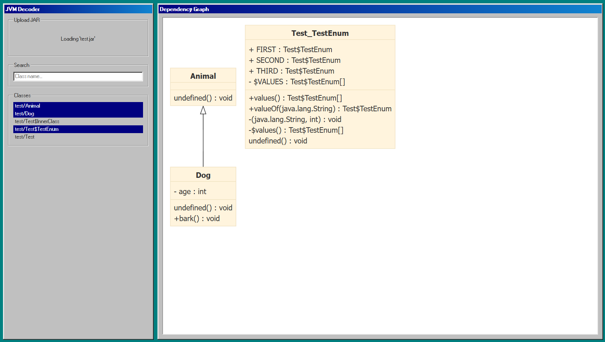

> JVM-Decoder in TypeScript.



---

## Getting Started

```shell
# Install dependencies
npm install

# Build .class-files for the test
javac -d ./test/ ./test/Test.java
# Build .jar-file for the test
jar cf ./test/test.jar ./test/*.class

npm run build
```

## Run Test

```shell
# Test .class-file-parser
cd ./test/
npx tsx ./ClassParser.test.ts
cd ../

# Test tool
npm run dev
```

## Courtesy

1. [Windows 98 based CSS Framework](https://github.com/jdan/98.css)

## References

1. [JVM-Specification: Chapter 4. The class File Format](https://docs.oracle.com/javase/specs/jvms/se7/html/jvms-4.html)
